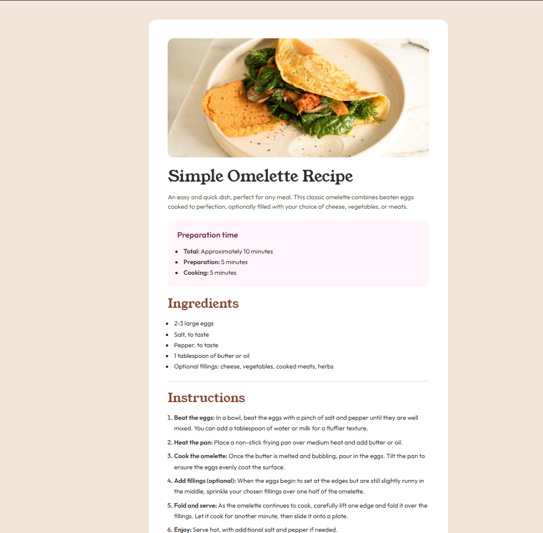

# Frontend Mentor - Recipe Page solution

This is a solution to the [Recipe Page challenge on Frontend Mentor](https://www.frontendmentor.io/challenges/recipe-page-KiTsR8QQKm).  
Frontend Mentor challenges help you improve your coding skills by building realistic projects.

## Table of contents

- [Overview](#overview)
  - [The challenge](#the-challenge)
  - [Screenshot](#screenshot)
  - [Links](#links)
- [My process](#my-process)
  - [Built with](#built-with)
  - [What I learned](#what-i-learned)
  - [Continued development](#continued-development)
  - [Useful resources](#useful-resources)
- [Author](#author)

## Overview

### The challenge

Users should be able to:

- View the optimal layout depending on their device’s screen size
- Read a clean and well-structured recipe page
- See a layout that follows the provided style guide (colors, typography, spacing)

### Screenshot



### Links

- Solution URL: https://github.com/jaseff2805/FrontEndMentor_SocialLinksProfile_Jaseff2805
- Live Site URL: https://jaseff2805.github.io/FrontEndMentor_RecipePage_Jaseff2805/

## My process

### Built with

- Semantic HTML5 markup
- CSS custom properties
- Flexbox
- Mobile-first workflow
- [Bootstrap 5](https://getbootstrap.com/)
- [Inter](https://fonts.google.com/specimen/Inter) via Google Fonts
- Git & GitHub for version control

### What I learned

This project helped me focus on writing **clean and semantic HTML** before styling, which made the layout easier to understand and maintain.

Key takeaways:

- When and why to use semantic elements like `main`, `article`, `header`, and `section`
- How to structure content so it remains readable even without CSS
- How to combine Bootstrap utility classes with custom CSS responsibly
- Improving accessibility using proper heading hierarchy and `aria-labelledby`

Example of semantic structure used in this project:

```html
<main>
  <article>
    <header>
      <h1>Recipe title</h1>
    </header>

    <section>
      <h2>Ingredients</h2>
    </section>
  </article>
</main>
```

### Continued development

In future projects I’d like to keep improving on:

- Accessibility best practices (ARIA roles, keyboard navigation testing)
- SCleaner and more scalable CSS structure
- Getting closer to pixel-perfect results based on design previews
- Adding subtle interactions without overengineering the solution

### Useful resources

- [MDN Web Docs](https://developer.mozilla.org/) – For HTML and CSS reference.
- [Bootstrap documentation](https://getbootstrap.com/docs/5.3/getting-started/introduction/) – To better understand Bootstrap’s utility classes and how to extend them.
- [Frontend Mentor](https://www.frontendmentor.io) – For the original challenge and design.

## Author

- Frontend Mentor - https://www.frontendmentor.io/profile/jaseff2805
- GitHub - https://github.com/jaseff2805
